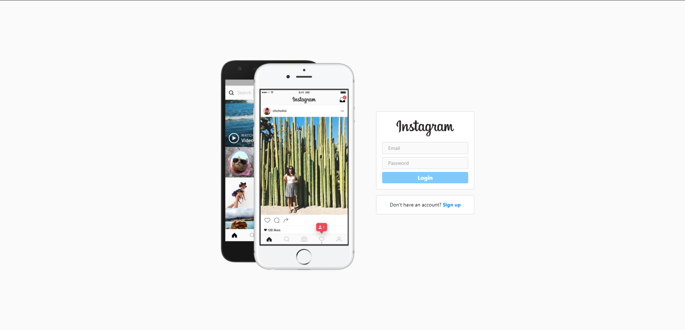
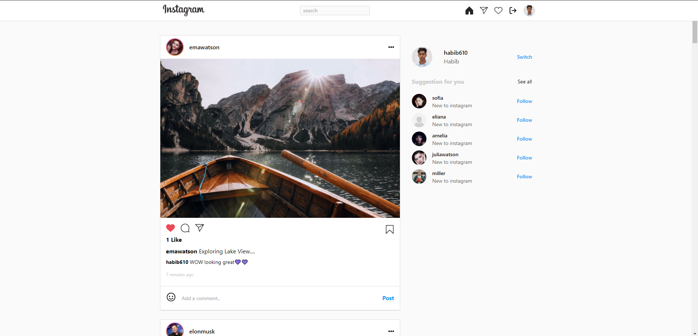
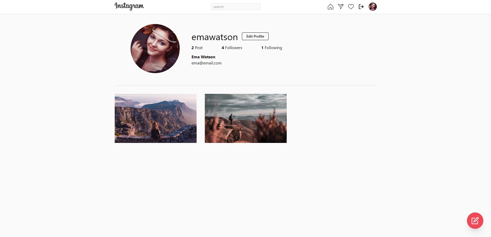
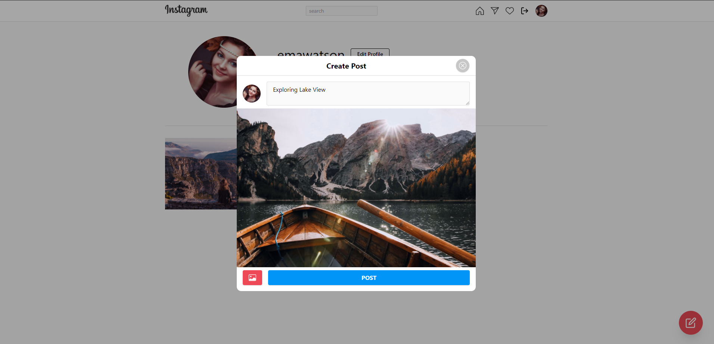
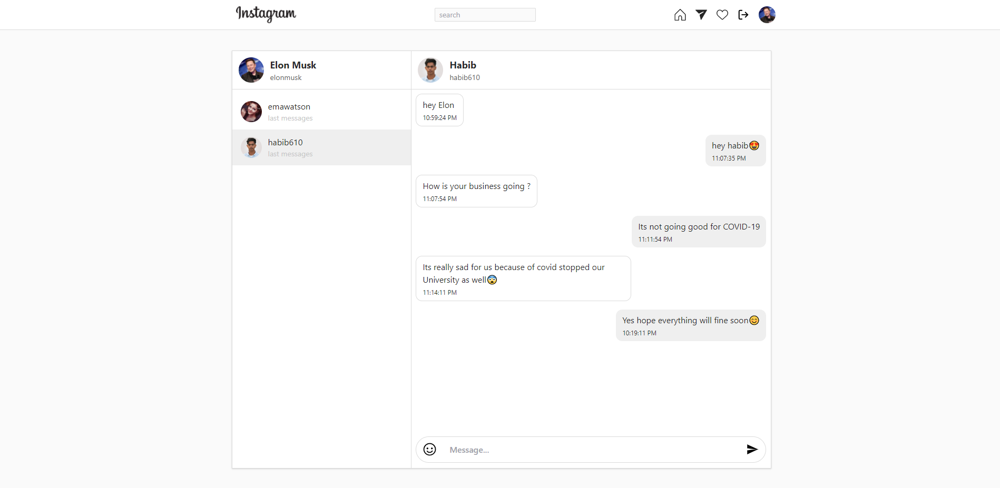
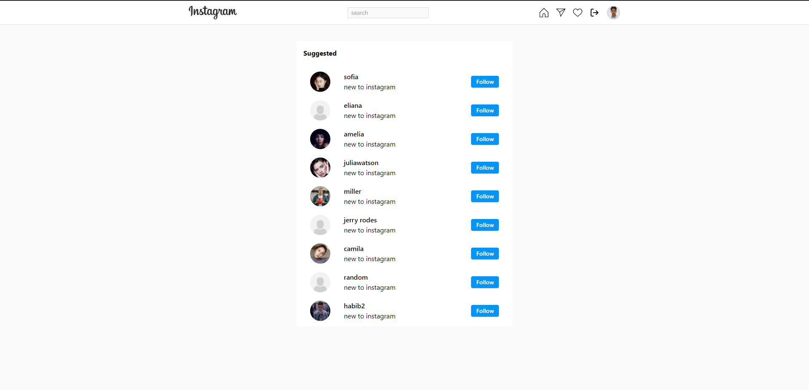

#   Instagram clone by React and Firebase
----

# Demo
## User Authentication

## Dashboard

## User Profile

## Create Post

## Realtime Messaging

## Explore User

---

# Overview
This application is a social media application which is the clone version of  Instagram. This app is created by React and Firebase. The basic functionalism is almost same as Real Instagram. The application has the following functionality:

1. Login and Registration 
2. Follow/Unfollow Users, Like/Comment Post
3. Create New Post
4. Display user Profiles and Photos
5. Realtime Messaging with followed Users
6. Update Profile
7. Explore users

# Technologies Used
 1. React.js
 2. Firebase (Auth, Firestore, Storage)
 3. Tailwindcss
 4. Emoji-Mart
 5. React-Loading-Skeleton
 6. Framer Motion

# Install packages and running the project:
1. ### `yarn` 
2. ### `yarn start`

Runs the app in the development mode.\
Open [http://localhost:3000](http://localhost:3000) to view it in the browser.

# Live Preview
## [https://instagramweb.vercel.app](https://instagramweb.vercel.app)